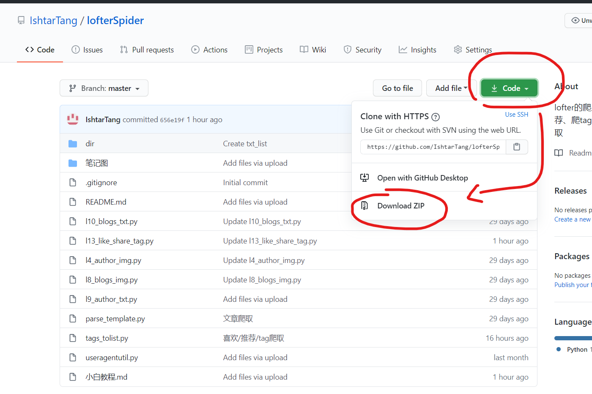
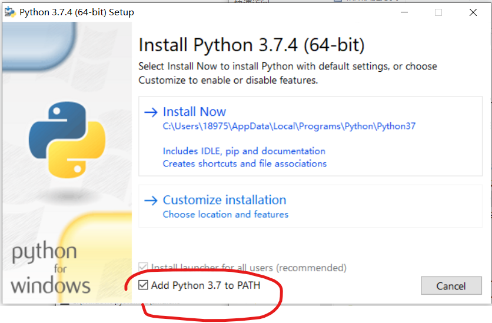
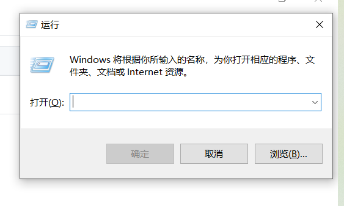
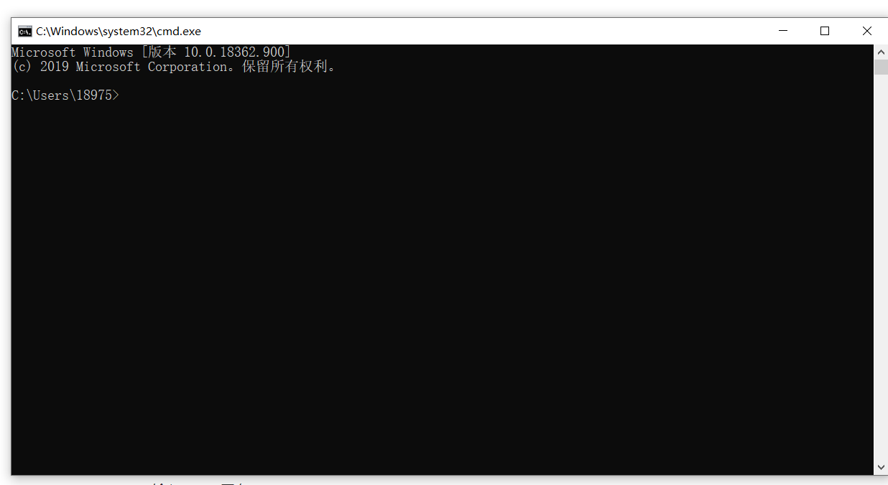
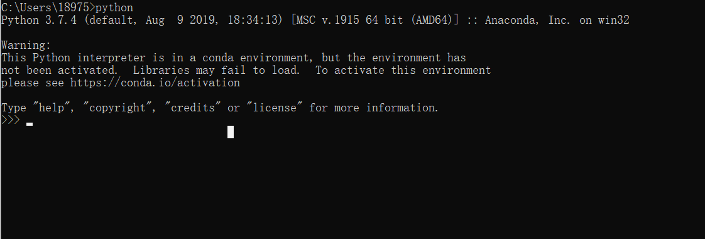
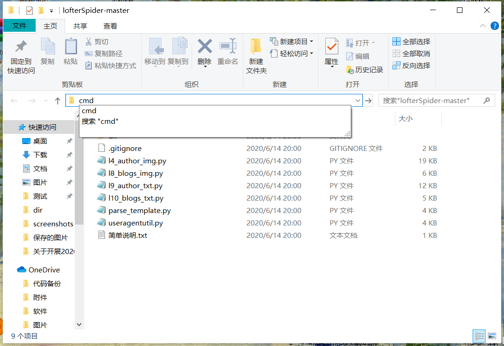
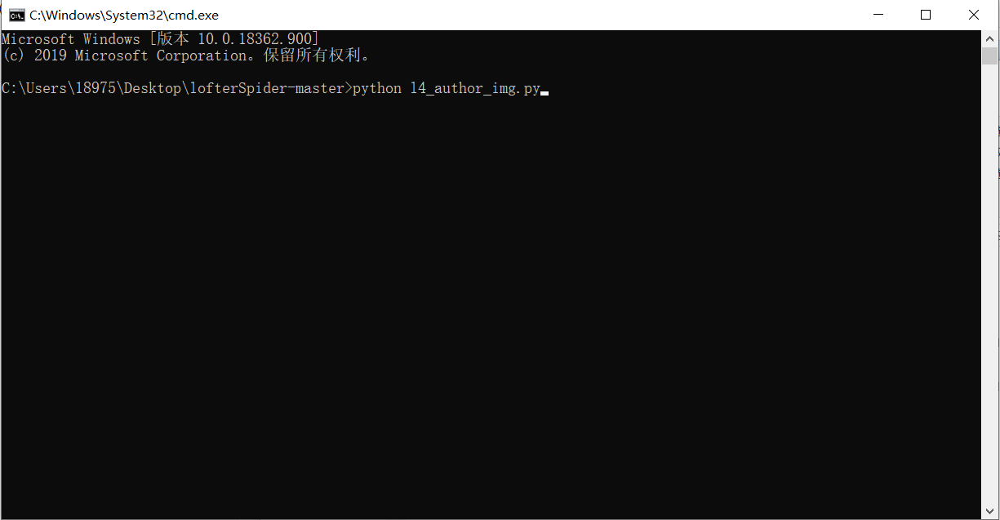
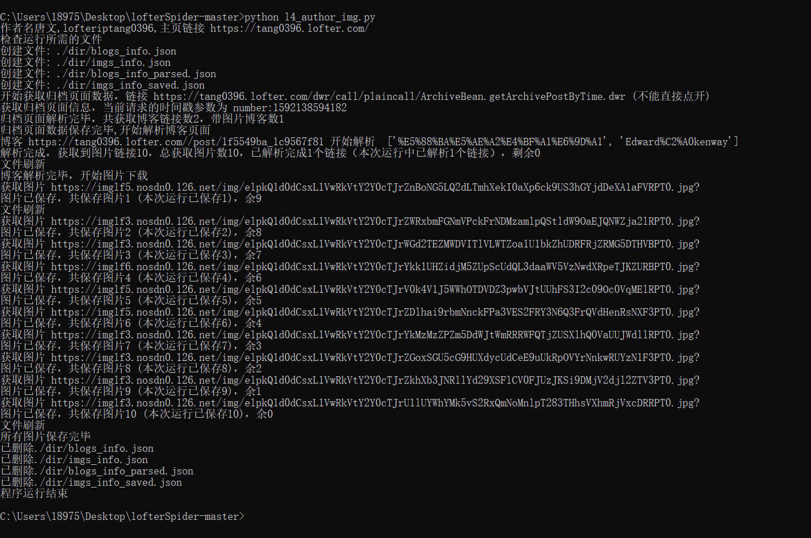

这部分是教完全不会编程的人如何运行程序。

我假设你没有任何编程基础，没用过命令行没运行过python程序没上过github电脑上啥都没有。

##### github

下载在这

下载好好了解压出来，不能在压缩包里运行

README.md是说明文档，页面直接向下划拉也是。

 

##### 安装python

首先你得装个python的编译器

去python官网下  https://www.python.org/downloads/ ，或者百度云 https://pan.baidu.com/share/init?surl=mEgh6Ti0FBjk6MEwCjBiTw  提取码：ltib 

安装把 Add Python 3.7 to Path钩上，选Install Now就行

安装完按 win + r，会弹出来这个

输入 cmd  回车，跳出命令行界面

输入 python 回车

这样即为python安装成功，右上角点叉把这个cmd关掉。

##### 下载依赖

打开解压程序的文件夹，在路径栏里输入 cmd ，摁回车

回车之后会弹出个cmd窗口，敲这条指令  **pip install -r requirements.txt**，回车
这是安装一些依赖，第一次输入会需要等，很多进度条啥的，慢慢等跑完就行。如果卡住按 Ctrl + c 强制退出，重新输入
等它自己完整跑完一次后，再输一次这条指令，如果非常快的结束，且所有内容都以 Requirement already satisfied开头，就是成功了（如图），没成功就把这条指令多输几次，直到成功

出现红字一般是网不好，把指令多输几次（或者科学上网试试），直到成功
出现黄字但也能很快结束可以算成功，先接着往下做，出问题再找我

命令行：

打开文件夹，用记事本打开你要用的那个程序，划拉到最后按设置改，具体看README，改好在路径栏里输入 cmd 然后回车

输 python + 文件名，就能运行了，嫌文件名长可以就打个开头然后按 Tab键，可以自动补全

