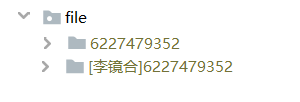
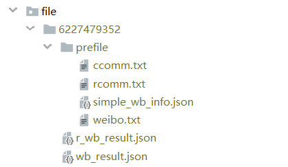

* [使 用](#使用)
  * [配置文件](#配置文件)
  * [启动](#启动)
* [结果文件](#结果文件)
* [联系我](#联系我)
* [其他](#其他)

### 使用

 

#### 配置文件

配置文件在configs下，`I1_userWB_config.json`是爬取用户微博的配置文件，一般使用改这个就行。

`I1_debug.json`比正常I1多两个调试项，我调试用的；I2 和 I3功能未完成。
可以搞多个配置文件，只要按格式写就行，在`scrapy_weiboSpider/config_path_file.py`中设置你要启用的配置文件路径。

灰框内为不用动的，蓝框内为基础设置，每个配置文件都有，橙框内为每个模式的功能设置

 

**不用动的部分**

`description`：用来看的

`id`：用来确认启用哪个模式

**基础配置**

`cookies_str`：登录状态信息，没有这个只能获取到一页内容，[cookies 获取](../笔记图/README/cookies获取.png)

`print_level`：设为1的话会多一些输出内容，属于无关紧要的配置，反正日志里该有的都有

 

**用户主页爬取配置**

功能是爬取一个用户发过的所有微博

`user_id`：[userid 获取](../笔记图/README/id获取.png)

`user_name`：你要爬取的用户的用户名。不写也行，因为这个项影响的是文件保存位置，具体看结果文件那里的说明。

`time_range`：如果你只想爬取一个用户某段时间内发的微博，就把这下面的`enable`设为1，start_time和stop_time就是字面意思，开始时间和结束时间，爬到的内容包括start_time发出的微博的，不包括stop_time发出的微博，即[start_time,stop_time）

 		`enable`：是否启用该功能，1启动，0关闭

 		`start_time`：格式为 `%Y-%m-%d %H:%M`的字符串，或毫秒级时间戳。可以为0，为0则不限制开始时间

 		`stop_time`：格式为 `%Y-%m-%d %H:%M`的字符串，或毫秒级时间戳。可以为0，为0则不限制结束时间

例：如果想只爬取2020-01-01到2021-01-01的微博

`get_comm_num`：保存多少评论

​		`wb_rcomm`：爬取每条微博下的多少根评论

​		`wb_ccomm`：爬取每条根评论下的多少子评论

​		若目标用户A转发了B的微博，B这条微博称为源微博（rwb）

​		`rwb_rcomm`：爬取每条源微博下的多少根评论

​		`rwb_ccomm`：爬取源微博每条根评论下的多少子评论

不会非常准确的爬到设定的条数，因为微博评论一次请求15条，请求到的会全部解析。在评论数量足够的情况下，会爬到比设定的多一些。

设为-1保存全部评论

 

**搜索模式配置**

爬关键词，搜出的所有微博+实时获取，还没写

**实时评论获取配置**

对一条/多条微博的评论进行实时爬取更新，还没写

    

#### 启动

 **环境配置**

首先你电脑肯定得装了python

项目路径下开命令行，输` pip install -r requirements.txt `

程序用到了redis来做进度记录和过滤，下载地址 https://github.com/tporadowski/redis/releases ，我用的版本是3.0.504。

解压后戳`redis-server.exe`，弹出右边的窗口就是启动成功了。每次程序启动前都需要先启动redis。

以上，环境准备完成

 

**启动程序**

先按前面说的修改配置文件

改好后 项目路径下敲  `scrapy crawl wb_spider`

它就跑起来了，把它扔那该干啥干啥，别断网就行，啥时候想起来就看看它跑完没。

 

 

 

### 结果文件

结果文件在./file下的对应文件夹里

爬取用户主页的文件标识由`user_id` `user_name`  `time_range`决定，

只设置了`user_id`时，文件标识为user_id，

设置了`time_range`时，时间范围添加在user_id后（x是不设结束时间）

设置了`user_name`时，用户名添加在user_id前

`time_range`和 `user_name`都设置了，则两个都有

结果文件夹的内容：

假如你爬了A的微博主页，其中wb_result.json中为A发过的所有微博，r_wb_result.json中为A所有转发微博的源微博。

文件中一个dict为一条微博。

[结果文件示例](../笔记图/README/保存文件示例.png) 

[结果文件中各字段的含义](../笔记图/README/保存文件字段-1628644419723.png)

prefile中为文件记录和过程文件。

其中simple_wb_info.json会在程序结束时产生，里面是所有爬过的微博的简单信息，如果程序只启动一次的话这个文件可以直接删，这个文件是用在重复启动时节约时间的。

weibo.txt、rcomm.txt 和ccomm.txt是过程文件，weibo是微博信息，rcomm是根评论信息，ccomm是子评论信息，程序结束时会整合到两个result文件中，运行结束后可以选择是否删除。

### 联系我

有问题的话我的邮箱是 ishtartang@163.com，如果要讨论，微信号`Ishtar_Tang`，备注从微博爬虫来的。

### 其他

同一文件标识下，爬过的微博不会重复爬取，不同标识下能够重复爬取。比如我用`6227479352`作为标识运行一次程序，再用`[李镜合]6227479352`作为标识运行一次程序，两个文件夹下都会有他所有微博的完整信息。.

 

 

如果要对文件进行更新，就比如你今天爬了A的所有微博，一个月后他新发了100条文微博，可以直接用上次的配置启动，程序会自动判断哪些是爬过的，新获取到的微博会更新到文件里。如果要进行这种更新的话，记得别删`simple_wb_info.json`。

 

 

程序并没有对每一条微博的详情页都进行一次请求，比如爬取用户主页模式，首先请求的是这个页面 [李镜合首页](https://weibo.com/u/6227479352?is_all=1) ，一次请求可以获取到15条微博，这个页面足够获取到大多数微博的完整信息，可以直接进行解析，但超过140字的微博会被折叠，这种时候才会请求微博详情页，比如 [李镜合的微博](https://weibo.com/6227479352/KrpUXclws)

 

 

需要发送请求的主要部分：首页请求（每页3次），评论请求（每15条评论一次），长微博详情页请求（一条一次），源微博详情页请求（一条一次）。外链和文章请求出现较少，且因需要即时返回结果使用的是requests，此处不作计算。

设A主页有x条微博，get_all_comment和get_all_r_comment设为0

最少请求次数是 x/15*3（所有微博长度不超过140字，所有微博为原创，所有微博无评论）

最多请求次数是 x/15\*3 +3x (所有微博为转发微博且所有微博和源微博下都有评论)

 

 

`simple_wb_info`的作用是记录所有已经解析过的微博。

比如A新转发了自己以前发过的微博，而那条旧的微博之前爬过了，程序就会直接从里面读出那条旧的微博，减少请求次数。

另一个，如果是重复启动做更新，目前的话更新还是会先把所有主页页数都请求一遍，解析前会先判断`simple_wb_info`里有没有这条，有的话就跳过不再做解析。之后的会做优化，如果爬到的是已经有了的就不继续翻页，到时候`simple_wb_info`在这上面就没啥发挥了。

  

不用再往下看了，这个上面有，直接在上面插表格感觉看着很不爽，所以上面插的图片链接，这是为了方便以后万一要修改留的表格备份。

文件中各字段含义

| 键               | 含义                                                  | 类型              |
| ---------------- | ----------------------------------------------------- | ----------------- |
| bid              | 微博bid，一条微博的唯一标识                           | str               |
| t_bid            | 哪条微博转发了当前微博，只有r_wb_result中的此项不为空 | str               |
| weibo_url        | 该条微博链接                                          | str               |
| user_id          | 用户id                                                | str               |
| user_name        | 用户名                                                | str               |
| content          | 微博正文                                              | str               |
| public_time      | 发表时间                                              | str               |
| public_timestamp | 发表时间戳                                            | int               |
| share_scope：    | 可见范围                                              | str               |
| like_num         | 点赞数                                                | int               |
| forward_num      | 转发数                                                | int               |
| comment_num      | 评论数                                                | int               |
| is_original      | 是否为原创，原创为1，转发为0，快转为-1                | int               |
| links            | 微博正文中包含的链接                                  | list，list中为str |
| img_list         | 图片链接列表                                          | list，list中为str |
| video_url        | 视频链接                                              | str               |
| weibo_from       | 微博来源                                              | str               |
| article_url      | 文章链接                                              | str               |
| article_content  | 文章内容                                              | str               |
| remark           | 备注                                                  | str               |
| r_href           | 如果是转发的微博，这里是源微博的url，否则空           | str               |
| r_weibo          | 如果是转发的微博，这里是源微博的简单信息，否则空      | str               |
| comments         | 评论信息列表                                          | dict              |

comments下各字段含义

| 键              | 含义                                                      | 类型 |
| --------------- | --------------------------------------------------------- | ---- |
| content         | 评论内容                                                  | str  |
| user_name       | 评论人的名字                                              | str  |
| user_url        | 评论人主页链接                                            | str  |
| comment_date    | 评论时间                                                  | str  |
| comment_type    | 直接回复微博的评论为root评论，评论下的回复为child评论     | str  |
| parent_comment  | child_comment是回复了哪条评论，root评论无parent_comment， | str  |
| like_num        | 点赞数                                                    | int  |
| comment_img_url | 评论中带的图片链接                                        | str  |
| link            | 评论中带的链接                                            | str  |
| chile_comm      | 子评论，即该条评论下的回复，子评论键值内容与父评论相同    |      |

